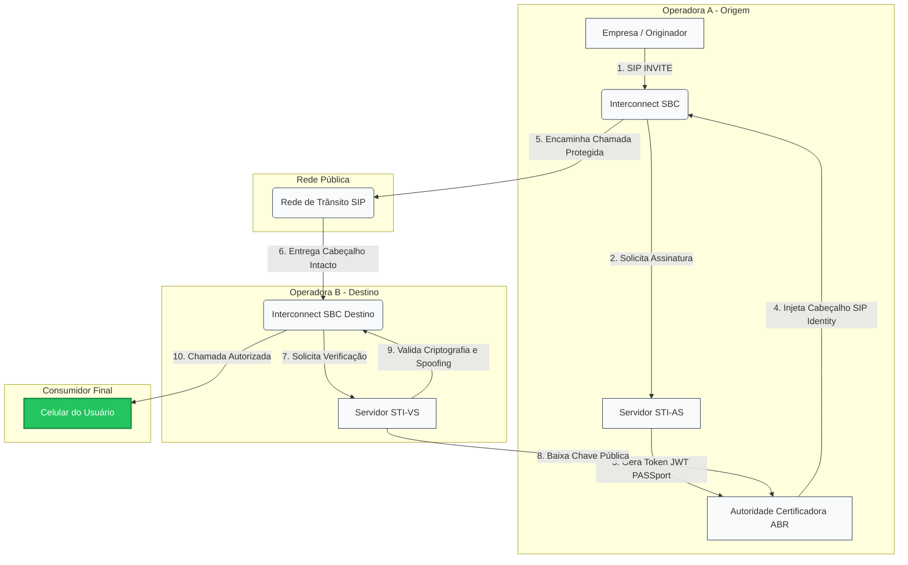

# Topologia Arquitetural e Funcionamento do STIR/SHAKEN

## Fluxograma de Tráfego de Chamadas Autenticadas (SIP)

---

## Descrição Detalhada das Etapas

1. **Início da Sessão:** A empresa discadora envia um pacote inicial `SIP INVITE` para sua operadora de origem.
2. **Interceptação na Borda:** O equipamento **SBC** da operadora de origem recebe a chamada e, antes de repassá-la ao mundo externo, aciona o servidor de segurança.
3. **Autenticação e Assinatura:** O servidor **STI-AS** valida a identidade da empresa, define a classificação da chamada (*Attestation A, B ou C*) e gera uma assinatura criptográfica no formato JWT.
4. **Trânsito Seguro:** A chamada trafega pela internet das operadoras carregando a assinatura intacta no cabeçalho `SIP Identity`.
5. **Verificação de Destino:** O **SBC** da operadora que recebe a ligação direciona o cabeçalho para o servidor **STI-VS**, que consulta a chave pública na **ABR Telecom** para validar a autenticidade.
6. **Entrega Visual:** Se o token for legítimo, o sinal é enviado via rede digital **VoLTE** diretamente para o smartphone do usuário final, ativando a exibição do selo verificado, nome e logotipo da empresa.

---

##  Glossário Técnico do Ecossistema
* **SIP Identity:** O cabeçalho adicionado à mensagem SIP que transporta o token de segurança da chamada.
* **Spoofing:** Ataque onde a identidade da origem da chamada é adulterada para simular um número legítimo (falsificação).
* **VoLTE (Voice over LTE):** Protocolo de voz sobre redes 4G/5G obrigatório para transportar as informações visuais ricas validadas pelo STIR/SHAKEN.
* **Attestation (Atribuição):** O nível de confiança dado a uma chamada (A para total confiança, B para parcial e C para chamadas de gateways desconhecidos).

